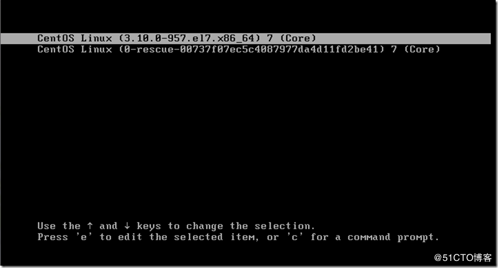
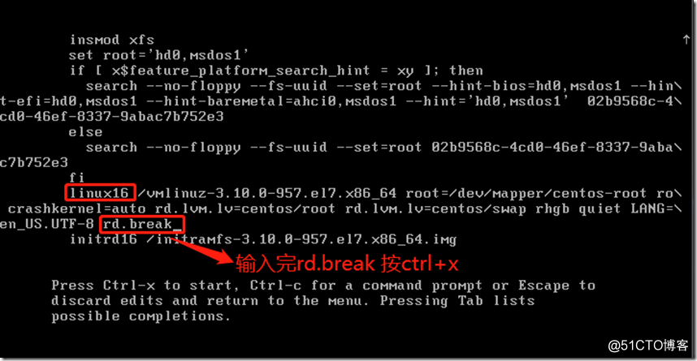
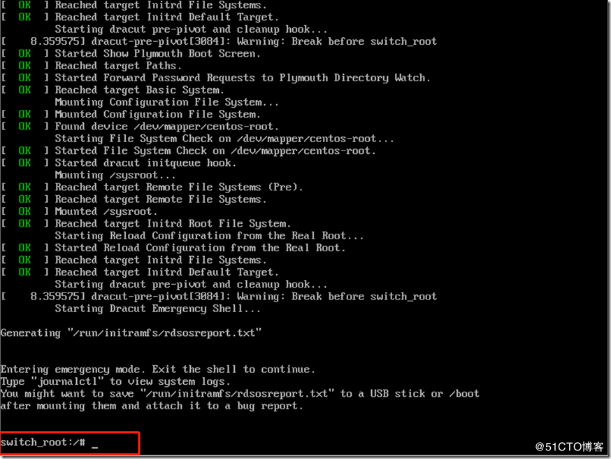
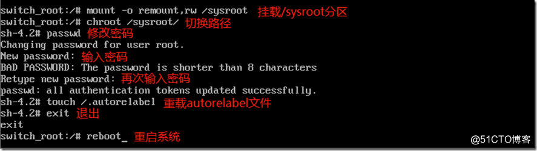
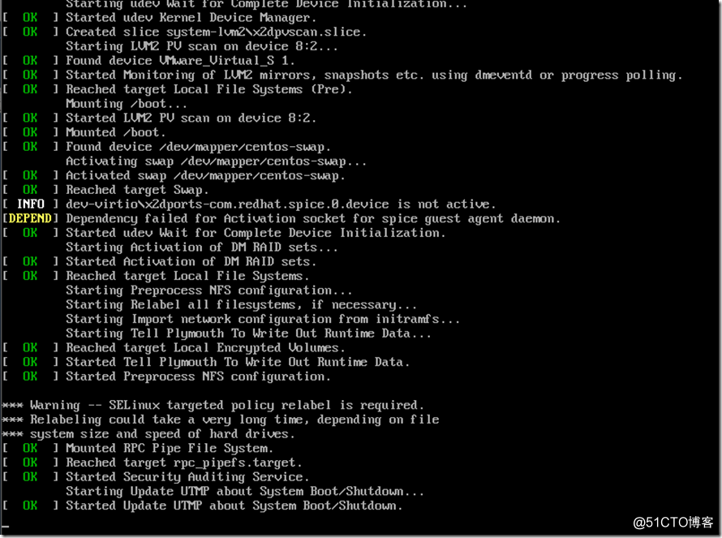
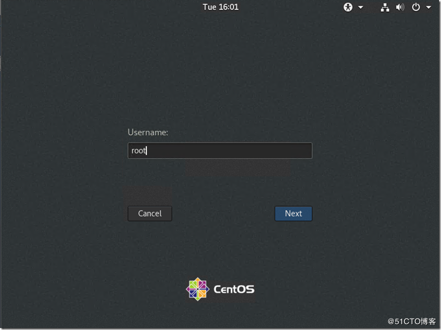
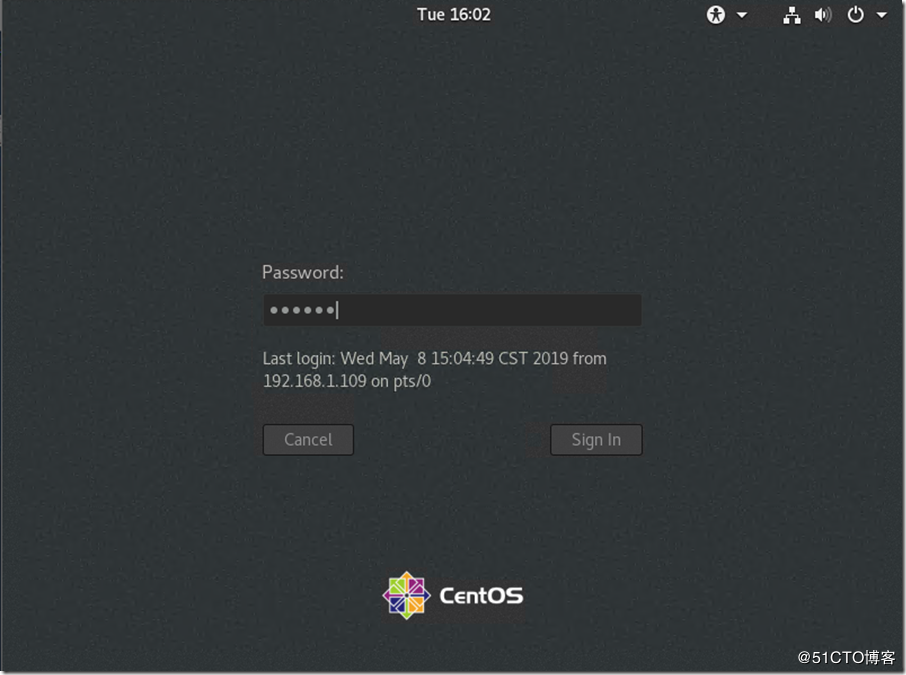
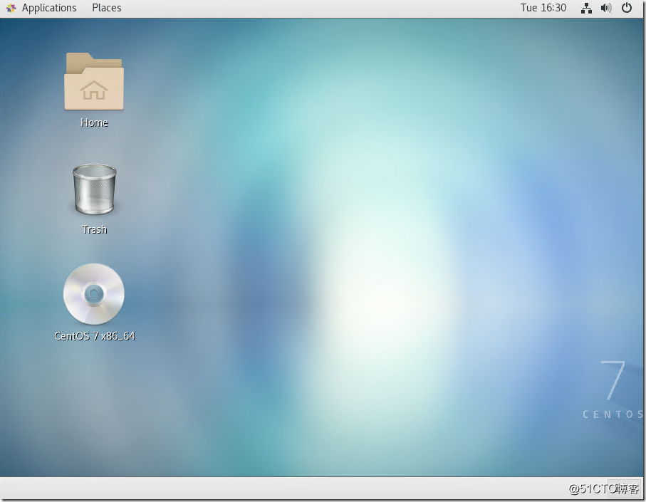

# Linux

[TOC]


## 软件安装

### VMware 安装

**软件下载地址** 

centos7.6:   https://vault.centos.org/7.6.1810/isos/x86_64/
vm15.5.1:    https://www.nocmd.com/windows/740.html

**VMware Workstation的安装激活密钥:**

```shell
# 选择一个能用的密钥就行, 每一行都是一个密钥
ZF3R0-FHED2-M80TY-8QYGC-NPKYF
YF390-0HF8P-M81RQ-2DXQE-M2UT6
ZF71R-DMX85-08DQY-8YMNC-PPHV8
YG5H2-ANZ0H-M8ERY-TXZZZ-YKRV8
UG5J2-0ME12-M89WY-NPWXX-WQH88
UA5DR-2ZD4H-089FY-6YQ5T-YPRX6
```

去 BIOS 中开启虚拟化设备支持

1.  安装虚拟机软件 VMware 

    

    

    

    

    不建议安装在 C 盘

    

    

    取消启动时的检查更新和加入客户体验提升计划

    

    

    

    

    点击安装，完成

    


### CentOS 安装

运行安装好的 VMware，选择创建虚拟机


选择默认推荐的典型


稍后安装操作系统


选择 Linux 系统，红帽7版本


选择名称和安装目录，不推荐 C 盘


给虚拟机分配 20 个 G 就差不多了，选择拆分为多个文件


自定义硬件


分配处理器，一般给电脑内核数量的一半


网络适配器选择 NAT 模式，记得将启动时自动连接选上。


自定义硬件就完成了，点击关闭，再点击完成。但是此时我们只是画出了磁盘空间等信息，操作系统还没安装。


右键点击设置


选择 CD/DVD 选项，选中使用 ISO 映像文件，选择自己的 CentOS 7 版本的所在地，点击确定


点击开启此虚拟机


启动后鼠标双击黑色界面，使用上下键选中第一个选项并回车


选择系统的语言，中文在最下面，再点击继续


点击继续进入后续页面后请不要立即操作，等待 CentOS 检查完毕再操作，后续都是如此。


本地化检查是否正确，再点击软件选择。


选择 GNOME 桌面，选中右边的3个选项，点击完成


点击安装位置


选择我要配置分区，然后点击完成


点击 + 号按钮添加第一个分区，`/boot` 分配 1G


选择标准分区和 `ext4` 文件系统


再分配一个 `swap` 分区，分配 2G


选择标准分区


添加根分区，将剩余空间都给它


选择标准分区和 `ext4` 文件系统


点击完成，接收更改


点击 KDUMP


取消启用 KDUMP，然后点击完成，生产环境建议开启，学习可以关闭，因为它会占内存


点击网络和主机


开启以太网，更改主机名字，点击应用，最后完成


点击开始安装


设置 ROOT 密码


创建一个普通用户，Linux 系统不推荐使用 ROOT 用户进行操作，所以我们创建一个普通用户


创建好后，等待 CentOS 安装完成，安装完成后点击`重启`按钮并`同意许可证`再点击`完成配置`进入登录页面，使用`root`进入系统。


### 安装 vmtools

-   `vmtools` 安装后可以让我们在 `Windows` 下更好的管理 vm 虚拟机啊
-   可以设置 `Windows` 和 `CentOS` 的共享文件夹

<font color='red'>**需要安装了 ``gcc``**</font>，`gcc -v` 可以查看 gcc 的信息。


不管是重新安装还是安装点就行了，如果是灰色，无法点击，重新启动一次系统，在进入的过程中点击，记住一定要使用root账号进行操作


`cd /opt/` 进入到 opt 目录中


`tar -zxvf 复制到opt目录下的文件夹的名字`


`cd vmware-tools-distrib/`


`./vmware-install.pl `


**然后一直回车就行了**

 


### 共享文件夹


点击添加根据步骤选择需要共享的文件夹即可。傻瓜式操作。


查看共享文件夹 `/mnt/hgfs可以查看共享文件夹`


### 安装 Xshell、Xftp

下载地址：https://www.netsarang.com/en/free-for-home-school/

通过 `Email` 给你发送下载地址

傻瓜式安装，下一步就行，记得更改安装位置。


### 远程登录 CentOS

查看 `CentOS` 的 ip 地址：`ifconfig`


打开 Xshell，新建一个会话。


双击刚才创建的会话，输入你在 `CentOS` 中创建的用户的用户名和密码远程登录到 `CentOS` 终端。


### 远程文件传输

打开 Xftp 软件，新建一个会话。


连接创建的会话，输入你在 `CentOS` 中创建的用户的用户名和密码远程登录到 `CentOS` 终端。

登录后就可以进行文件传输了。


## Vim 编辑器

`vim 文件名`：打开一个文件，如果此文件不存在，会先创建再打开。

### Vim 的三种模式

-   正常模式
    -   使用 `vim xxx` 打开一个文件就进入了正常模式了
-   插入模式
    -   按下 `i、I、o、O、a、A、r、R` 等任何一个字母后才会进入插入模式，一般来说按 i 即可
-   命令行模式
    -   在这个模式中，可以提供相关指令，完成读取、存盘、替换、离开 vim，显示行号等动作。

**各个模式之间的转换图**


### Vim 快捷键

`V` 进入多选模式

`VG` 全选


`yy` 拷贝当前行

`Nyy` 拷贝当前行下的 N 行


`dd` 删除当前行

`Ndd` 删除当前行下的 N 行


`p` 粘贴

`u` 撤销

`ctrl+r` 恢复


`/需要查找的关键字` 回车查找，输入 `n` 查找下一个


`:set nu` 显示行号

`:set nonu` 隐藏行号


`G` 定位到末行

`gg` 定位到首行

`数字 shift g` 定位到指定的行


## 常用命令

### 关机重启

`shutdown -h now` 			 立即进行关机

`shutdown -h 1` 				   "hello 1 分钟后会关机了"

`shutdown -r now` 			 现在重启计算机

`halt` 									立即关机

`reboot` 								现在重启计算机

`sync` 									把内存的数据同步到磁盘


### 用户登录和注销

`su - 用户名` 切换登录用户

`logout` 注销、退出用户


### 用户管理

#### 添加用户

`useradd 用户名` 添加用户

-   当创建用户成功后，会自动的创建和用户同名的家目录，该用户的家目录在 `/homt/用户名`
-   也可以通过 `useradd -d 指定目录 用户名` ，给新创建的用户指定家目录


#### 修改密码

`passwd 用户名` 给指定用户设置密码 


#### 删除用户

`userdel 用户名` 删除用户，但是家目录依据存在

`userdel -r 用户名` 删除用户，同时删除该用户的家目录


#### 查看用户信息

`id 用户名` 查看用户信息，当用户不存在时，返回 `无此用户`。


#### 切换用户

`su - 切换用户名` 切换用户

-   当权限高的用户切换到权限低的用户，不需要输入密码，反之需要
-   当需要返回到原来用户时，可以使用 `exit/logout` 指令


#### 查看当前用户

`whoani` / `who an I` 查看第一次登录用户信息，登录后切换用户再查看仍然显示第一次登录用户的信息


#### 用户组

**介绍**

类似于角色，系统可以对有 `共性/权限` 的多个用户进行同一管理。( 给组一个权限，组内所有用户都拥有 )


`groupadd 组名` 新增组

`groupdel 组名` 删除组


`useradd -g 组名 用户名` 添加用户的同时将用户添加到指定的用户组中

**注意：**如果添加用户时没有指定用户组，系统会新建一个与用户同名的组，并将新添加的用户添加进去。


`usermod -g 组名 用户名` 修改用户的用户组


#### 用户和用户组相关文件

-   `/etc/passwd` 文件
    -   用户 ( user ) 的配置文件，记录用户的各种信息
    -   每行的含义：`用户名:口令:用户标识号:组标识号:注释性描述:主目录:登录Shell`
-   `/etc/shadow` 文件
    -   口令的配置文件
    -   每行的含义：`登录名:加密口令:最后一次修改时间:最小时间间隔:最大时间间隔:警告时间:不活动时间:失效时间:标志`
-   `/etc/group` 文件
    -   组 ( group ) 的配置文件
    -   每行的含义：`组名:口令:组标识号:组内用户列表`


### 运行级别

运行级别说明：

-   0：关机
-   1：单用户 ( 找回丢失密码 )
-   2：多用户状态没有网络服务
-   3：多用户状态有网络服务
-   4：系统未使用保留给用户
-   5：图像界面
-   6：系统重启

常用运行级别时 3 和 5，也可以指定默认运行级别。

`init 运行级别` 切换到不同的运行级别


-   CentOS 7 后运行级别说明
    -   在 CentOS 7 以前，`/etcinittab` 文件中进行了简化，如下
        -   `multi-user.target`：`analogous to runlevel3`
        -   `graphical.target`：`analogous to runlevel3`
    -   `systemctl get-default` 查看系统的当前运行级别
    -   `systemctl set-default 运行级别` 设置系统的默认运行级别 


### 找回 root 密码

本次案例使用的是CentOS 7.6版本操作系统

进入单用户模式

1.  首先重启你的服务器，在出现内核版本时，按键盘上的tab键会静止在如下界面。



2.  选中第一个内核，按“e”进入“grub”界面，找到Linux16开头的行，按“end”键到字段末尾，在末尾添加“rd.break”。添加完后，按“Ctrl + x”保存进入单用户模式



3.  等待进入单用户模式



4.  由于更改密码需要用到/sysroot这个分区中的数据，而这个分区默认情况下是只读的，所以需要对它进行重新挂载，并赋予rw权限

```
mount -o remount,rw /sysroot/
```

5.  进入系统环境里面

```
chroot /sysroot
```

6.  修改密码 **( 最好8位以上，但不是必须的 )**，保存，exit退出系统环境

```
passwd
touch /.autorelabel
exit
```

7.  重启系统

```
reboot
```



8.  等待加载 **( 时间可能有点长，耐心等待 )** 进入到登录界面



9.  用新的密码登录root用户





10. 修改密码成功，进入桌面




### 帮助指令

`man` 获得帮助信息

基本语法：`man 命令或配置文件` ( 功能描述：获得帮助信息 )

案例：查看 `ls` 命令的帮助信息


`help` 指令

基本语法：`help 命令` ( 功能描述：获得 shell 内置命令的帮助信息 )


### 文件目录类

#### 查看当前工作目录的绝对路径

`pwd` 指令

基本语法：`pwd` ( 功能描述：显示当前工作目录的绝对路径 )


#### 查看目录下的文件和文件夹

`ls` 指令

基本语法：`ls 选项 目录或文件`

常用选项：

​	`-a`：显示当前目录所有的文件和目录，包括隐藏的

​	`-l`：以列表的方式显示信息

  

#### 切换目录

`cd` 指令

基本语法：`cd 参数` ( 功能描述：切换到指定的目录 )

理解：绝对路径和相对路径

`cd ~` 或者 `cd`：回到当前登录用户的家目录；比如：`root` 用户使用 `cd ~` 会到 `/root` 目录，`hong` 用户会到 `/home/hong` 目录

`cd ..`：回到当前目录的上一级


#### 创建目录

`mkdir` 指令

`mkdir` 指令用于创建目录

基本语法：`mkdir 选项 要创建的目录`

常用选项：

​	`-p` 创建多级目录


#### 删除空目录

`rmdir` 指令

`rmdir` 指令删除空目录

基本语法：`rmdir 选项 要删除的空目录`

使用细节：

​	如果 `rmdir` 删除的目录下有内容是无法删除的

​	如果需要删除非空目录，需要使用 `rm -rf 要删除的目录` 指令进行删除  


#### 创建空文件

`touch` 指令

`touch` 指令创建空文件

基本语法：`touch 文件名称`


#### 拷贝文件或文件夹

`cp` 指令

`cp` 指令拷贝文件到指定目录

基本语法：`cp 选项 拷贝资源 拷贝路径`

常用选项：

​	`-r` 递归复制整个文件夹

使用细节：

​	强制覆盖不提示的方法：`\cp`

拷贝文件夹下的所有内容到指定该目录

​	`cp -r /资源路径/* /拷贝路径`


#### 删除文件或文件夹

`rm` 指令

说明：`rm` 指令移除文件或目录

基本语法：`rm 选项 要删除的文件或目录`

常用选项：

​	`-r`：递归删除整个文件夹

​	`-f`：强制删除不提示


#### 移动文件与目录或重命名

`mv` 指令

基本语法：

​	`mv oldFileName newFileName` ( 重命名 )

​	`mv oldPath newPath` ( 移动文件 )


#### 查看文件内容

##### `cat` 指令

基本语法：`cat 选项 要查看的文件`

常用选项：

​	`-n`：显示行号

使用细节：`cat` 只能浏览文件，不能修改文件


##### `more` 指令

`more` 指令是一个基于 VI 编辑器的文本过滤器，它以全屏幕的方式按页希纳是文本文件的内容。`more` 指令中内置了若干快捷键

基本语法：`more 要查看的文件`


##### `less` 指令

`less` 指令用来分屏查看文件内容，它的功能与 `more` 指令类似，但是比 `more` 指令更加强大，支持各种显示终端。`less` 指令在显示文件内容时，**并不是一次将整个文件加载之后才显示，而是根据显示加载需要的内容，对于显示大型文件具有较高的效率。**

基本语法：`less 要查看的文件`


#### 输出内容到控制台

`echo` 指令

基本语法：`echo 选项 输出内容`


#### 显示文件的开头部分内容

`head` 指令

`head` 用于显示文件的开头部分内容，默认情况下的 `head` 指令显示文件的前10行内容

基本语法：

​	`head 文件` ( 查看文件头10行内容 )

`	head -n 5 文件` ( 查看文件头5行内容，5可以是任意行数 )


#### 显示文件的尾部部分内容

`tail` 指令

`tail` 用于输出文件中尾部的内容，默认情况下 `tail` 指令显示文件的后10行内容

基本语法：

​	`tail 文件`				( 查看文件尾10行内容 )

​	`tail -n 5 文件`	 ( 查看文件尾5行内容，5可以是任意行数 )

​	`tail -f 文件`		 ( 实时追踪该文档的所有更新，`ctrl + c 退出` )


#### `> 指令` 和 `>> 指令`

`>`：输出重定向

`>>`：追加

基本语法：

​	`ls -l > 文件` ( 列表的内容写入到指定文件中 ( 覆盖写 ) )

​	`ls -al >> 文件` ( 列表的内容追加到指定文件的末尾 )

​	`cat 文件1 > 文件2` ( 文件1的内容覆盖到文件2，如果文件2不存在会自动创建 )

​	`echo 内容 >> 文件1` ( 文件1追加指定的内容 )


#### `ln 指令`

软连接也称为符号连接，类似于 `windows` 里的快捷方式，主要存放了链接其他文件的路径

基本语法：`ln -s [原文件或目录] [软链接名]` ( 给原文件创建一个软链接 )


#### 查看执行过的历史指令

`history` 指令

查看已经执行过的历史指令，也可以执行历史指令

基本语法：

​	`history` ( 查看所有执行过的历史指令 )

​	`history 10` ( 查看最近执行的10条历史指令 ) 

​	`!5` （ 执行编号为5的历史指令 ）


### 时间日期

#### 显示当前时间

`date` 指令

基本语法：

​	`date` ( 显示当前时间 )

​	`date + %Y` ( 显示当前年份 )

​	`date + %m` ( 显示当前月份 )

​	`date + %d` ( 显示当前是哪一天 )

​	`date +%Y-%m-%d %H:%M:%S` ( 显示年月日时分秒 )


#### 设置日期

`date` 指令

基本语法：`date -s 字符串日期`


#### 查看日历

`cal` 指令

查看日历指令 `cal`

基本语法：`cal 选项` ( 不加选项，显示本月日历 )


### 搜索查找

#### 查找文件或目录

`find` 指令

`find` 指令将从指定目录向下递归地遍历其各个子目录，将满足条件的目录或文件显示在终端

基本语法：`find 搜索范围 选项`

选项说明：


#### 快速定位文件路径

`locate` 指令

`locate` 指令可以快速定位文件路径。`locate` 指令利用事先建立的系统中所有文件名称及路径的 `locate` 数据库实现快速定位给定的文件。`locate` 指令无需遍历整个文件系统，查询速度较快，为了保证查询结果的准确度，管理员必须定期更新 `locate` 时刻

基本语法：`locate 搜索文件`

特别说明：由于 `locate` 指令基于数据库进行查询，所有第一次运行前，必须使用 `updatendb` 指令创建 `locate` 数据库。


#### 过滤查找

`grep` 指令和管道符号

`grep` 过滤查找。管道符 `|` ，表示将前一个命令的处理结果输出传递给后面的命令处理

基本语法：`grep 选项 查找内容 源文件`

常用选项：

​	`-n`：显示匹配行及行号

​	`-i`：忽略字母大小写


### 压缩和解压

#### `gzip/gunzip` 指令

`gzip` 用于压缩**文件**，`gunzip` 用于解压

基本语法：

​	`gzip 文件` ( 压缩文件，只能将文件压缩为 `*.gz` 文件 )

​	`gunzip 文件.gz` ( 解压文件命令 ) 


#### `zip/unzip` 指令

`zip` 用于压缩**文件**，`unzip` 用于解压。这个在项目打包发布中很有用

基本语法：

​	`zip 选项 xxx.zip 要压缩的内容` ( 压缩文件和目录的命令 )

​	`unzip 选项 XXX.zip` ( 解压文件 )

`zip` 常用选项

​	`-r`：递归压缩，即压缩目录

`unzip` 常用选项

​	`-d 目录`：指定解压后文件的存放目录


#### `tar` 指令

`tar` 指令

`tar` 指令是打包指令，最后打包的文件是 `.tar.gz` 的文件

基本语法：`tar 选项 XXX.tar.gz 打包内容` ( 打包目录，压缩后的文件格式 `.tar.gz` )

常用选项：

​	`-c`：产生 `.tar` 打包文件

​	`-v`：显示详细信息

​	`-f`：指定压缩后的文件名

​	`-z`：用 `gzip` 压缩或解压

​	`-x`：解压 `.tar` 文件


### 组管理

#### 文件/目录 所有者

一般谁创建的文件，谁就是该文件的所有者

**查看文件的所有者**

基本指令：`ls -ahl` ( `a:显示所有文件和目录, 包括隐藏的`、`h:文件或目录的大小按人类习惯的方式显示`、`l:显示详细信息` )

`ls 文件名 -lh` 查看指定文件名的权限

**修改文件所有者**
基本指令：`chown 用户名 文件名`


#### 组的创建

基本指令：`groupadd 组名`


#### 文件/目录 所在组

**查看文件/目录所在组**

基本指令：`ls -ahl`

`ls 目录 -lh` 查看指定目录的权限

**修改文件所在组**

基本指令：`chgrp 组名 文件名`

 

#### 其他组

除文件的所有者和所在组的用户外，系统的其他用户都是文件的其他组


#### 改变用户所在组

在添加用户时，可以指定将该用户添加到哪个组中，同样的用 `root` 的管理权限可以改变某个用户所有在的组

**改变用户所在组**

基本指令：`usermod -g 新组名 用户名`

**改变用户登录的初始目录**

基本指令：`usermod -d 目录名 用户名` 

特别说明：用户需要有进入到新目录的权限才能修改初始目录


### 权限管理

#### 权限的基本介绍

`ls -l` 指令显示的内容如下：

```yaml
-rw-rw-r--.  1 hong hong  484 5月  17 11:26 hello.java

-rw-rw-r--.: 权限
1: 文件:硬链接数  目录:子目录数+文件数
hong: 用户
hong: 组
484: 文件大小(字节), 如果是文件夹显示484字节
5月  17 11:26: 最后修改时间
hello.java: 文件名
```

0-9位说明：

-   第0位确定文件类型  ( d, -, l, c, b )
    -   `l`是链接，相当于 windows 的快捷方式
    -   `d`是目录，相当于 windows 的文件夹
    -   `-`是普通文件
    -   `c`是字符设备文件，鼠标、键盘
    -   `b`是块设备，比如硬盘
-   第1-3位确定所有者 ( 该文件的所有者 ) 拥有该文件的权限
-   第4-6位确定所属组 ( 用户组 ) 拥有该文件的权限
-   第7-9位确定其他用户拥有该文件的权限


#### rwx权限详解

**rwx作用到文件**

-   `r`代表可读 ( read )：可以读取，查看
-   `w`代表可写 ( write )：可以修改，但是不代表可以删除文件，删除一个文件的前提是对该文件所在的目录有写权限才能删除该文件
-   `x`代表可执行 ( execute )：可以被执行

**rwx作用到目录**

-   `r`代表可读 ( read )：可以读取，`ls`查看目录内容
-   `w`代表可写 ( write )：可以修改，对目录内创建+删除+重命名目录
-   `x`代表可执行 ( execute )：可以进入该目录

**数字表示rwx**

​	`r=4`、`w=2`、`x=1`。因此 `rwx=4+2+1=7`


#### 修改权限

`chmod` 指令

基本说明：通过 `chmod` 指令，可以修改文件或者目录的权限

**第一种方式**

`+、-、=` 变更权限

`u`：所有者	`g`：所在组	`o`：其他人	`a`：所有人( u、g、o的总和 )

基本指令：

​	`chmod u=rwx,g=rw,o=r 文件名/目录名` ( 给所有者赋予 `rwx` 权限、所在组赋予 `rw`、其他人赋予 `r` 到指定文件或目录 )

​	`chmod o+w 文件名/目录名` ( 给其他人赋予 `w` 权限到指定文件或目录 )

​	`chmod a-x 文件名/目录名` ( 撤销所有人对指定文件或目录的 `x` 权限 )

**第二种方式**

通过数字变更权限

`r=4`、`w=2`、`x=1` 	``rwx=4+2+1=7`	

`1: x` `2: w` `3:wx` `4:r` `5:rx` `6:rw` `7:rwx`

`chmod u=rwx,g=rx,o=x 文件名/目录名` 相当于 `chmod 751 文件名/目录名`


#### 修改文件/目录所有者

基本语法：

​	`chown 所有者 文件/目录` ( 改变所有者 )

​	`chown 所有者:所在组 文件/目录` ( 改变所有者和所在组 )

选项

​	`-R`：如果是目录，则使其下所有子文件和目录递归生效


#### 修改文件/目录所在组

基本语法：`chgrp new所在组 文件/目录` ( 改变所在组 )


### crond 任务调度

crontab 进行定时任务的设置

**概述**

任务调度：是指系统在某个时间执行的特定的命令或程序

任务调度分类：

​	系统工作：有些重要的工作必须周而复始地执行。如病毒扫描

​	个别用户工作：个别用户可能希望执行某些程序。比如对数据库的备份

**基本语法**

 `crontab 选项`

**常用选项**

​	`-e`：编辑 crontab 任务

​	`-l`：查询 crontab 任务

​	`-r`：删除当前用户所有的 crontab 任务


#### 快速入门

设置任务调度文件：`/etc/crontab`

设置个人任务调度：执行 `crontab -e` 命令

再执行 `*/1 * * * * ls -l /etc/ > /tmp/to.txt`

每小时的每分钟执行 `ls -l /etc/ > /tmp/to.txt` 命令


#### cron 表达式

##### 参数细节说明

5个占位符的说明


##### 特殊符号说明


#### crond 相关指令

`crontab -r`：终止任务调度

`crontab -l `：列出当前有那些任务调度

`service crond restart`：重启任务调度


#### at 定时任务

**基本介绍**

-   at 命令是一次性定时计划任务，at 的守护进程 atd 会以后台模式运行，检查作业队列来运行
-   默认情况下，atd 守护进程每60秒检查作业队列，有作业时，会检查作业运行时间，如果时间与当前时间匹配，则运行此作业
-   at 命令时一次性定时计划任务，执行完一个任务后不再执行此任务
-   在使用 at 命令的时候，一定要保证 atd 进程的启动，可以使用相关指令来查看 `ps -ef | grep atd`

**at 命令格式**

​	`at 选项 时间`

​	两次`Ctrl + D` 结束 at 命令的输入

**at 命令选项**


**at 时间定义**

at 指定时间的方法：

-   接受在当天的 `hh:mm(小时:分钟)` 式的时间指定。加入该时间已过去，那么就放在第二天执行。例如：21:00
-   使用 `midnight(深夜)`，`noon(中午)`，`teatime(饮茶时间, 一般是下午4点)` 等比较模糊的单词来指定时间。
-   采用 12 小时计时制，即在时间后面加上 `AM(上午)` 或 `PM(下午)` 来说明是上午还是下午。例如：12PM
-   指定命令执行的具体日期，指定格式位 `month day(月 日)` 或 `mm/dd/yy(月/日/年)` 或 `dd.mm.yy(日.月.年)`，指定的日期必须跟在指定时间后面。例如：`21:00 2021/5/18`
-   使用相对计时法。指定格式为：`now + count time-units`，`now` 就是当前时间，`time-units` 是时间单位，这里能够是 `minutes(分钟)`、`hours(小时)`、`days(天)`、`weeks(星期)`。`count` 是时间的数量，几天，几小时。例如：`now + 5 minutes`
-   直接使用 `today(今天)`、`tomorrow(明天)`来指定完成命令的时间

**查看 at 列表**

​	`atq`

**删除 at 定时任务**

​	`atrm 编号`


## 磁盘分区

### 磁盘分区机制

**原理介绍**

-   Linux 来说无论有几个分区，分给哪一目录使用，它归根结底只有一个根目录，一个独立且唯一的文件结构，Linux 中每个分区都是用来组成整个文件系统的一部分
-   Linux 采用一种叫 `载入` 的处理方法，它的整个文件系统中包含了一整套的文件和目录，且将一个分区和一个目录联系起来。这时要载入一个分区将使它的存储空间再一个目录下获得。

**示意图**


#### 查看所有设备挂载情况

命令：`lsbk` 或 `lsblk -f`


```
NAME:分区名	FSTYPE: 分区格式	UUID:分区唯一标识, 格式化后才有	  MOUNTPOINT:挂载点
```


#### 硬盘说明

-   Linux 硬盘分为 `IDE` 硬盘和 `SCSI` 硬盘，目前基本上是 `SCSI` 硬盘。
-   对于 `IDE` 硬盘，驱动器标识符为 `hdx~`，其中 `hd` 表明分区所在设备的类型，这里是指 `IDE` 硬盘。`x` 为盘号 ( `a` 为基本盘、`b` 为基本从属盘、`c` 为辅助主盘、`d` 为辅助从属盘 )，`~` 代表分区，前四个分区用数字1到4表示，它们是主分区或拓展分区，从5开始就是逻辑分区。例：`hda3` 表示为第一个 `IDE` 硬盘上的第三个主分区或拓展分区，`hdb2` 表示第二个 `IDE` 硬盘上的第二个主分区或拓展分区。
-   对于 `SCSI` 硬盘则标识为 `sdx~`，`SCSI` 硬盘是用 `sd` 来标识分区所在设备的类型的，其余和 `IDE` 硬盘的表示方法一致。


#### 增加一块硬盘

##### 虚拟机添加硬盘


再选择硬盘大小后一直下一步就行。然后**重启系统** ( 才能识别 )。


##### 分区

分区命令：`fdisk /dev/sdb(硬盘名)`


`m`：显示命令列表

`p`：显示磁盘分区 同 `fdisk -l`

`n`：新增分区

`d`：删除分区

`w`：写入并退出

`q`：不保存退出


##### 格式化

如果分区不格式化，Linux 不会为其分配 UUID。

命令：`mkfs -t ext4 /dev/sdb1(分区名)`


##### 挂载

命令：`mount /dev/sdb1(分区名) /newdisk(挂载点)`

**<span style="color:red;">注意：使用命令行挂载，重启后会失效。</span>**

**卸载**

​	`umount 设备名称 或 挂载目录`

​	例如：`umount /dev/sdb1` 或者 `umount /newdisk`


##### 设置自动挂载

通过修改 `/etc/fstab` 实现自动挂载


添加完成后执行 `mount -a` 即刻生效或者重启


#### 磁盘情况查询

**查询系统整体磁盘使用情况**

基本语法：`df -h`

**查询指定目录的磁盘占用情况**

基本语法：`du -h /目录` ( 查询指定目录的磁盘占用情况，默认为当前目录 )

选项：

​	`-s`：指定目录占用大小汇总

​	`-h`：带计量单位

​	`-a`：含未见

​	`--max-depth=1`：子目录深度

​	`-c`：列出明细的同时，增加汇总值


#### 磁盘情况实用指令

-   统计文件夹下文件的个数

    `ls -l | grep "^-" | wc -l`

-   统计文件夹下目录的个数

    `ls -l | grep "^d" | wc -l`

-   统计文件夹下文件的个数，包括子文件夹里的

    `ls -lR | grep "^-" | wc -l`

-   统计文件夹下目录的个数，包括子文件夹里的

    `ls -lR | grep "^d" | wc -l`

-   以树状显示目录结构

    `tree 目录` ( 不写目录，默认为当前目录 )

    Linux 默认是没有安装 `tree` 指令的，需要执行 `yum install tree` 进行安装，安装过程中全部输入 `y` 继续安装。


## Linux 网络环境配置

### 指定 IP

#### 第一步

说明：直接修改配置文件来指定 IP，并可以连接到外网 ( 程序员推荐 )

编辑 `vim /etc/sysconfig/network-scripts/ifcfg-ens33`

```shell
BOOTPROTO=static
# IP地址
IPADDR=192.168.200.130
# 网关
GATEWAY=192.168.200.2
# 域名解析器
DNS1=192.168.200.2
```


#### 第二步


网关最后一个数字为 2


最后应用修改就行。


#### 第三步

重启网络服务或者重启系统生效

`service network restart`、`reboot`


### 设置主机名

-   为了方便记忆，可以给 Linux 系统设置主机名，也可以根据需要修改主机名
-   查看主机名：`hostname`
-   修改文件 `/etc/hostname` 中指定
    -   这个文件中只存放了主机名，所以我们可以随意修改，不要怕改炸了
-   修改后，重启生效


### 设置 hosts 映射

设置 hosts 映射可以使我们通过主机名访问到 Linux 系统

Windows：

​	在 `C:\Windows\System32\drivers\etc\hosts` 文件中指定

​	添加：`192.168.200.130 hong` 可以让我们在 Windows 中 `ping hong` 时访问到 `192.168.200.130`

Linux：

​	在 `/etc/hosts`

​	添加：`192.168.200.1 hong` 可以让我们在 Linux 中 `ping hong` 时访问到 `192.168.200.1`

虽然在两个系统中设置的映射都是 `hong`，但是不影响我们使用，因为这是给当前系统使用的。


### 重启网卡失败 service network restart 失败

>   概要： 报Job for network.service failed because the control process exited with error code. See “systemctl status network.service” and “journalctl -xe” for details. 的错误

重启网络管理工具

>   systemctl stop NetworkManager
>
>   systemctl disable NetworkManager

然后重新启动服务

>   service network restart


## 进程管理

### 显示系统执行的进程

**基本介绍**

`ps` 指令可以用来查看目前系统中有那些正在执行以及它们执行的状况。可以不加任何参数

**`ps` 显示的信息选项**

| 字段    | 说明                                                         |
| ------- | ------------------------------------------------------------ |
| USER    | 用户名称                                                     |
| PID     | 进程标识号                                                   |
| %CPU    | 进程占用CPU的百分比                                          |
| %MEM    | 进程占用的物理内容从百分比                                   |
| VSZ     | 进程占用的虚拟内容的大小 ( 单位：KB )                        |
| RSS     | 进程占用的物理内容的大小 ( 单位：KB )                        |
| TTY     | 终端机号                                                     |
| STAT    | 进程状态：`S睡眠`、`s表示该进程是会话的先导进程`、`N表示进程拥有比普通优先级更低的优先级`、`R正在运行`、`D短期等待`、`Z僵死进程`、`T被跟踪或者被停止`... |
| STARTED | 进程的启动时间                                               |
| TIME    | 进程使用CPU的总时间                                          |
| COMMAND | 启动进程所用的命令和参数，如果过长会被截断显示               |

**选项**

| 选项 | 说明                       |
| ---- | -------------------------- |
| -a   | 显示当前终端的所有进程信息 |
| -u   | 以用户的格式显示进程信息   |
| -x   | 显示后台进程运行的参数     |


### 中止进程

- 若是某个进程执行过程需要停止时，或是已消耗了很大的系统资源时，此时可以考虑停止该进程，使用 `kill` 命令来完成此项任务

####  基本语法

`kill 选项 进程号` ( 通过进程号中止进程 )

`killall 进程名称` ( 通过进程名称中止进程，也支持通配符，这在系统因负载过大而变得很慢时很有用 )

**常用选项**

`-9`：表示强迫进程立即停止

####  **强制踢出指定的用户**  

- hong用Xshell登录，root用Centos7图形化界面登录：在图形化界面执行：`ps -ef | grep sshd`


- 使用 `kill 4708` 结束这个进程，可以强制踢出指定的用户。

#### 中止远程登录 `sshd` 服务

- `ps -ef | gerp sshd` 找到 `sshd` 进程 `/user/sbin/sshd -D`
  - `kill 1110` 中止 `sshd` 服务 ，中止后将不能再远程登录到当前系统中。

####  重启 `sshd` 服务

- 在适当的时候再次重启sshd服务：`/bin/systemctl start sshd.service`

####  终止多个进程`killall`

- `killall gedit `   //关闭所有文本编辑器

### 查看进程树

基本语法：`pstree 选项`

常用选项：

​	`-p`：显示进程的 PID

​	`-u`：显示进程的所属用户

### 服务管理

#### service管理指令

> 服务 ( service ) 本质就是进程，但是是运行在后台的，通常都会监听某个端口，等待其他程序的请求，比如 ( mysql，sshd，防火墙等 )，因此我们又称为守护进程，是 Linux 中非常重要的知识。

-   `service 服务名 [start | stop | restart | reload | status]`
-   <span style="color: red">**在 CentOS7.0 后很多服务不再使用 `service`，而是 `systemctl`**</span>
-   `service` 指令管理的服务在 `/etc/init.d` 查看

**查看服务名**

方式一：使用 `setup`，选择 `系统服务` 就可以看到全部

方式二：`ls -l /etc/init.d` 看到 `service` 指令管理的服务

#### systemctl管理指令

- ``systemctl` 指令管理的服务在 `/usr/lib/systemd/system` 查看：==`ls -l /user/lib/systemed/system	`==
  - 基本语法：`systemctl [start | stop | restart | status] 服务名`

#####  systemctl 设置服务自启动状态

-   `systemctl list-unit-files [| grep 服务名]` ( 查看服务开机启动状态，grep 可以进行过滤 )
-   `systemctl enable 服务名` ( 设置服务开机启动 )
-   `systemctl disable 服务名` ( 关闭服务开机启动 )
-   `systemctl is-enabled 服务名` ( 查询某个服务是否是自启动的 )

#### 打开或者关闭指定端口

在真正的生产环境，往往需要将防火墙打开，但问题来了，如果我们把防火墙打开，那么外部请求数据包就不能跟服务器监听端口通讯。这是，需要打开指定的端口。比如80、22、8080等。

**`firewall` 指令**

打开端口：`firewall-cmd --permanent --add-port=端口号/协议`

关闭端口：`firewall-cmd --permanent --remove-port=端口号/协议`

打开或关闭端口需要重新载入才能生效：`firewall-cmd --reload`

查询端口是否开放：`firewall-cmd --query-port=端口/协议`

查看指定端口的占用情况：`netstat -ano | grep 端口号`


### 动态监控进程

**介绍**

`top` 与 `ps` 命令很相似，它们都是用来显示正在执行的进程，`top` 与 `ps` 最大的不同之处，在于 `top` 在执行一段时间可以更新正在运行的进程。

**基本语法**

`top 选项`

**常用选项**

| 选项    | 功能                                       |
| ------- | ------------------------------------------ |
| -d 秒数 | 指定 `top` 命令每隔几秒更新，默认是3秒     |
| -i      | 使 `top` 不显示任何闲置或者僵死进程        |
| -p      | 通过指定监控进程ID来仅仅监控某个进程的状态 |

**交互操作**

| 操作 | 说明                            |
| ---- | ------------------------------- |
| P    | 以 CPU 使用率排序，默认就是此项 |
| M    | 以内存的使用率进行排序          |
| N    | 以 PID 排序                     |
| q    | 退出 top                        |

**实战**

监控指定的用户

输入 `top` 指令回车进入监控页面，再输入 `u` 回车，最后输入需要监控的用户的用户名。

终止指定的进程

输入 `top` 指令回车进入监控页面，再输入 `k` 回车，再输入要结束的进程的 ID 号，最后输入 `9` 强制结束进程


### 监控网络状态

**查看系统网络情况 `netstat`**

基本语法：

​	`netstat 选项`

选项说明：

​	`-an`：按一定顺序排列输出

​	`-p`：显示哪个进程在调用

**检测主机连接命令 `ping`**

是一种网络检测工具，它主要是用来检测远程主机是否正常，或是两部主机间的网线或网卡故障

`ping 对方ip地址`


## `rpm` 和 `yum`

### rpm 包管理

#### 介绍

rpm 用于互联网下载包的打包及安装工具，它包含在某些 Linux 分发版中。它生成具有 `.RPM` 扩展名的文件。`RPM` 是 `RedHat Package Manager` ( RedHat 软件包管理工具 ) 的缩写，类似 `Windows` 的 `setup.exe`，这一文件格式名称虽然打上了 `RedHat` 标志，但理念是相同的。

Linux 的分发版都有采用 ( suse，redhat，centos... )，可以算是行业标准了。


#### rpm 包的简单查询指令

`rpm -qa` ( 查看所有安装的 rpm 软件包 )

`rpm -qa | more`

`rpm -qa | grep 过滤条件`


`rpm -q 软件包名` ( 查询软件包是否安装 )

`rpm -qi 软件包名` ( 查询软件包信息 )

`rpm -ql 软件包名` ( 查询软件包中的文件 )

`rpm -qf 文件全路径名` ( 查询文件所属的软件包 )


#### rpm 包名基本格式

一个 `rpm` 包名：`firefox-60.0.0-1.el7.centos.x86_64`

名称：`firefox`

版本号：`60.0.0-1`

使用操作系统：`el7.centos.x86_64` 表示 `centos7.x` 的64为系统

如果是 `i686`、`i386` 表示32为系统，`noarch` 表示通用。


#### rpm 包卸载

基本语法：

​	`rpm -e RPM包的名称`

如果其他软件包依赖于您要卸载的软件包，卸载时会产生错误信息。可以增加参数 `--nodeps` 就可以强制删除 `rpm -e --nodeps RPM包的名称`


#### rpm 包的安装

基本语法：

​	`rpm -ivh RPM包全路径名称`

参数说明

​	`i`：install 安装

​	`v`：verbose 提示

​	`h`：hash 进度条


### yum

**介绍**

`yum` 是一个 `shell` 前端软件包管理器。基于 `RPM` 包管理，能够从指定的服务器自动下载 `RPM` 包并且安装，可以自动处理依赖性关系，并且一次安装所有依赖的软件包。

**yum 的基本指令**

`yum list | grep 软件` ( 查询 yum 服务器是否有指定的软件 )

`yum install 软件` ( 下载安装 )


## 搭建 JavaEE 环境

### 安装 JDK8

1.  `mkdir /opt/jdk` 创建一个目录存放安装包

2.  通过 `xftp` 上传 `jdk8` 安装包到 `/opt/jdk` 下

3.  `cd /opt/jdk` 

4.  解压 `tar -zxvf 压缩包名`

5.  `mkdir /usr/local/java` 创建一个目录存放解压好的 `jdk`

6.  `mv /opt/jdk/解压好的jkd目录名 /usr/local/jdk` 移动解压好的 `jdk`

7.  配置环境变量的配置文件 `vim /etc/profile`

    ```shell
    # java environment
    export JAVA_HOME=jdk存放的绝对路径 #这是我的路径/usr/local/jdk/jdk1.8.0_181
    export CLASSPATH=.:${JAVA_HOME}/jre/lib/rt.jar:${JAVA_HOME}/lib/dt.jar:${JAVA_HOME}/lib/tools.jar
    export PATH=$PATH:${JAVA_HOME}/bin
    ```

8.  `source /etc/profile` 刷新环境变量的配置文件让文件生效

9.  命令行输入 `java`、`javac` 测试

 

### 安装 Tomcat

1.  `mkdir /opt/tomcat` 

2.  上传压缩文件

3.  `tar -zxvf 压缩包名` 解压 Tomcat

4.  `mkdir /usr/local/tomcat`

5.  `mv /opt/tomcat/解压好的tomcat目录名 /usr/local/tomcat`

6.  `cd /usr/local/tomcat/apache-tomcat-9.0.46/bin` 进入到 `bin` 目录

7.  `./startup.sh ` 启动 Tomcat

8.  `firewall-cmd --permanent --add-port=8080/tcp` 开放8080端口

9.  `firewall-cmd --reload` 使之生效

10.  `firewall-cmd --query-port=8080/tcp` 检测是否成功打开8080端口

11.  在 Windows 下访问 Linux 系统的 8080 端口测试是否成功

12.  `vim /etc/rc.d/rc.local` 自定义开机启动程序

     ```shell
     export JAVA_HOME=/usr/local/jdk/jdk1.8.0_181  #你的jdk路径
     /usr/local/tomcat/apache-tomcat-9.0.46/bin/startup.sh #tomcat下startup.sh文件的路径
     ```

13.  `chmod 751 /etc/rc.d/rc.local` 修改权限


### 安装 IDEA2020

1.  `mkdir /opt/idea`
2.  上传压缩文件
3.  `tar -zxvf 压缩包名` 解压
4.  `mkdir /usr/local/idea`
5.  移动压缩后的文件夹到 /usr/local/idea 中
6.  ` cd idea-IU-211.7142.45/bin` 进入到 `bin` 目录
7.  `./idea.sh` 运行 IDEA。需要在图形化界面才能运行


### 安装 MySql5.7

1.  `mkdir /opt/mysql`

2.  `cd /opt/mysql`

3.  `wget http://dev.mysql.com/get/mysql-5.7.26-1.el7.x86_64.rpm-bundle.tar` 下载压缩包

4.  <span style="color: red;">**CentOS7.6自带的类 MySql 数据库是 mariadb，会跟 MySql 冲突，要先删除**</span>

    1.  运行 `rpm -qa | grep mari`，查询 mariadb 相关安装包
    2.  运行 `rpm -e --nodeps mariadb-libs` 卸载
    3.  运行 `rpm -e --nodeps marisa` 卸载

5.  `tar -xvf mysql-5.7.26-1.el7.x86_64.rpm-bundle.tar ` 解压

6.  按顺序执行已下指令

    1.  `rpm -ivh mysql-community-common-5.7.26-1.el7.x86_64.rpm`
    2.  `rpm -ivh mysql-community-libs-5.7.26-1.el7.x86_64.rpm`
    3.  `rpm -ivh mysql-community-client-5.7.26-1.el7.x86_64.rpm`
    4.  `rpm -ivh mysql-community-server-5.7.26-1.el7.x86_64.rpm`

7.  运行 `systemctl start mysqld.service`，启动 mysql

8.  然后开始设置 root 用户密码。Mysql 自动给 root 用户设置随机密码，运行 `grep "password" /var/log/mysqld.log` 可查看当前密码

    ```shell
    # 密码在最后面: Q-V(rf*L_7hW
    2021-05-21T04:39:27.241374Z 1 [Note] A temporary password is generated for root@localhost: Q-V(rf*L_7hW
    ```

9.  运行 `mysql -u root -p`，用 root 用户登录，提示输入密码可用上面指令显示的密码，可以成功登录进入 mysql 命令行

10.  设置 root 密码，对于个人开发环境，如果要设比较简单的密码 ( 生产环境服务器要设复杂密码 )，可以运行 `set global validate_password_policy=0;`；提示密码设置策略 ( `validate_password_policy 默认值为1` )

11.  设置密码最小长度 `set global validate_password_length=4;`

12.  `set password for 'root'@'localhost' =password('1234');`

13.  运行 `flush privileges;` 使密码设置生效

